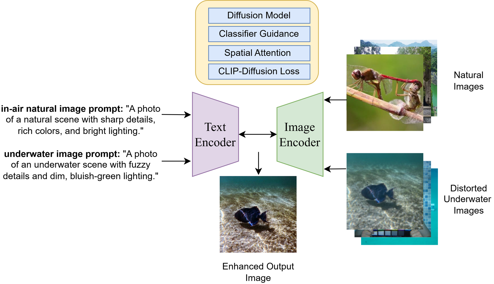
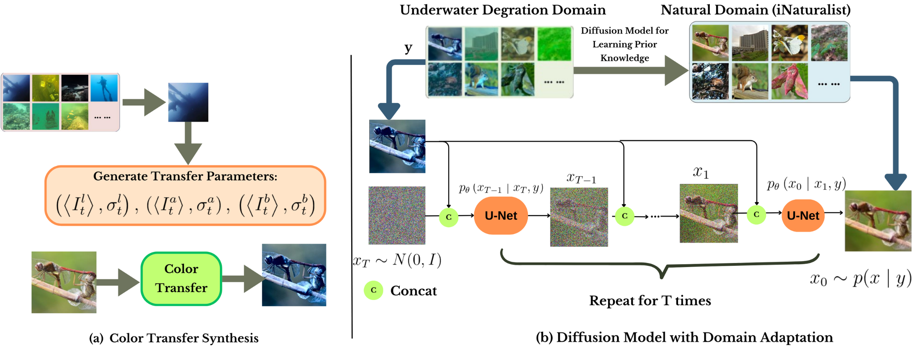
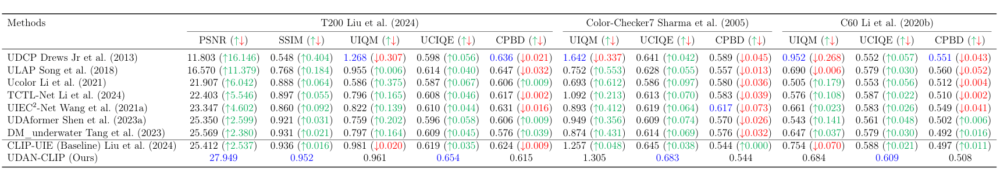
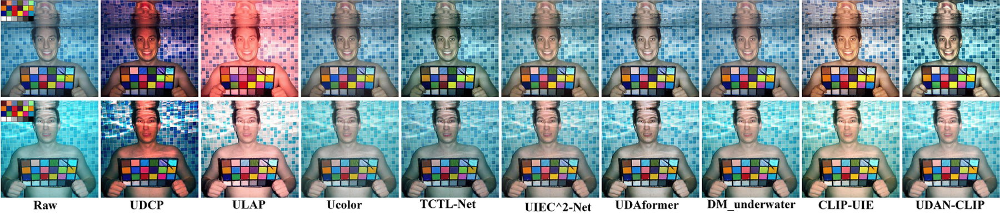
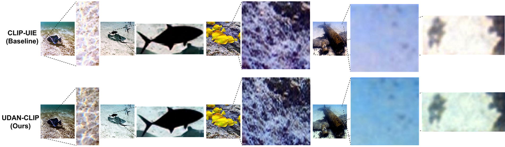
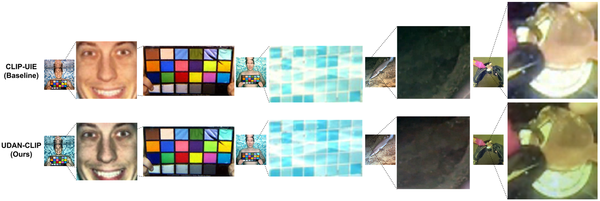
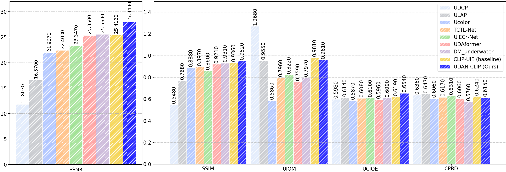
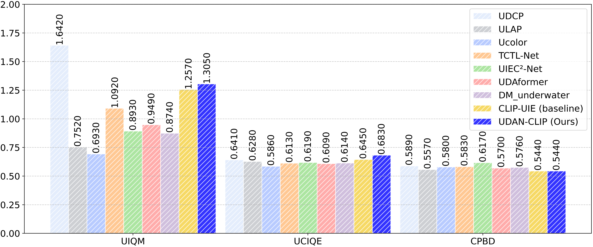
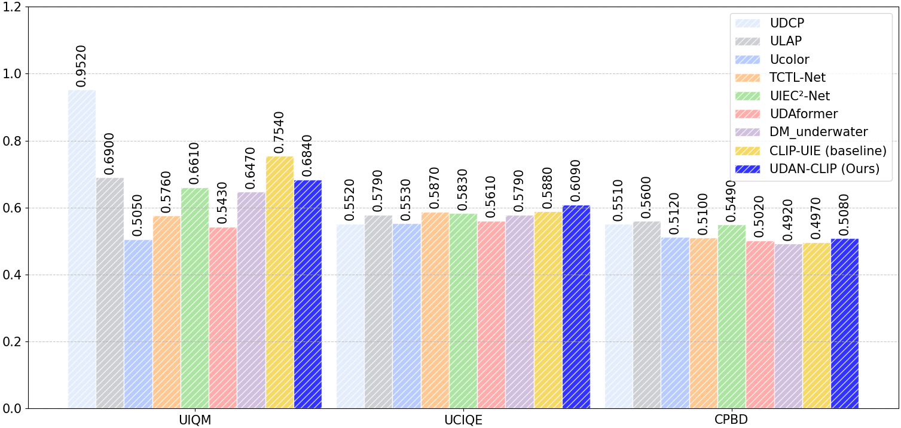
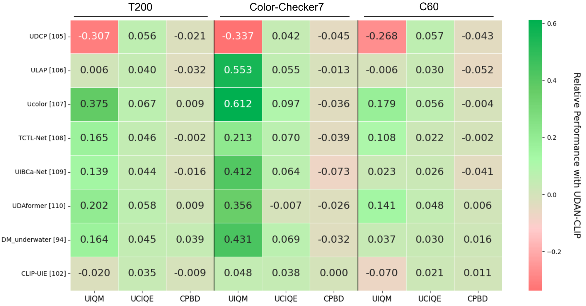

# <div align="center">UDAN-CLIP 🌊</div>
<div align="center">Afrah Shaahid, Muzammil Behzad</div>
<div align="center"><sup>King Fahd University of Petroleum and Minerals</sup></div>
<br>
<div align="center">
<a href="https://arxiv.org/abs/2505.19895"></a>
<a href="https://github.com/AfrahMS/udan-clip.github.io"></a>
<a href="https://opensource.org/licenses/MIT"></a>
</div>

> **UDAN-CLIP** (Underwater Diffusion Attention Network with Contrastive Language-Image Joint Learning) is a diffusion-based framework for underwater image enhancement. By integrating CLIP-guided semantic alignment, spatial attention mechanisms, and domain-adaptive diffusion modeling, our method restores color fidelity, contrast, and fine structures in images degraded by underwater scattering and absorption.

Underwater images suffer from complex degradations including light absorption, scattering, color casts, and artifacts—making enhancement critical for effective object detection, recognition, and scene understanding in aquatic environments. Existing methods, especially diffusion-based approaches, typically rely on synthetic paired datasets due to the scarcity of real underwater references, introducing bias and limiting generalization. Furthermore, fine-tuning these models can degrade learned priors, resulting in unrealistic enhancements due to domain shifts.

**UDAN-CLIP** addresses these challenges through an image-to-image diffusion framework pre-trained on synthetic underwater datasets and enhanced with a customized CLIP-based classifier, a spatial attention module, and a novel CLIP-Diffusion loss. The classifier preserves natural in-air priors and semantically guides the diffusion process, while the spatial attention module focuses on correcting localized degradations such as haze and low contrast.

Here is a pipeline diagram of UDAN-CLIP:


## Overview of UDAN-CLIP



UDAN-CLIP achieves high-quality underwater image enhancement through four key components working in harmony:

1. **Domain-Adaptive Diffusion Module**: Learns underwater degradation distributions and progressively restores clean images through a reverse diffusion process, preserving natural in-air priors while adapting to underwater domains.

2. **CLIP-Guided Classifier**: Leverages vision-language alignment to semantically guide the enhancement process, ensuring restored images maintain semantic consistency with textual descriptions of "clear underwater scenes."

3. **Spatial Attention Mechanism**: Focuses computational resources on heavily degraded regions (e.g., haze, backscatter, low-contrast areas), enabling targeted correction where it matters most.

4. **CLIP-Diffusion Loss**: A novel loss function that strengthens visual-textual alignment during reverse diffusion, helping maintain semantic consistency throughout the enhancement pipeline.

## Quick Start

### Step 1: Clone the Repository
```bash
git clone https://github.com/BRAIN-Lab-AI/UDAN-CLIP.git
cd udan-clip.github.io
```

### Step 2: Set Up Environment
```bash
# Create and activate virtual environment
python -m venv venv
source venv/bin/activate  # On Windows: venv\Scripts\activate

# Install dependencies
pip install -r requirements.txt
```

### Step 3: Download Datasets
Download the following datasets and place them in the `data/` directory:
- **T200 Dataset**: Underwater images from turbid environments
- **Color-Checker7**: Color calibration dataset
- **C60 Dataset**: Comprehensive underwater image collection

Dataset links and preparation scripts will be provided soon.

### Step 4: Configuration
Create a `config.yaml` file with your model settings:
```yaml
model:
  diffusion_steps: 1000
  clip_model: "ViT-B/32"
  spatial_attention: true
  
training:
  batch_size: 8
  learning_rate: 1e-4
  epochs: 100
  
data:
  dataset: "T200"
  image_size: 256
```

### Launch UDAN-CLIP

#### Inference on Single Image
```bash
python inference.py --input path/to/image.jpg --output results/
```

#### Batch Processing
```bash
python batch_process.py --input_dir data/test_images/ --output_dir results/
```

#### Training from Scratch
```bash
python train.py --config config.yaml --gpu 0
```

## Project Structure
```
├── data/
│   ├── T200/
│   ├── Color-Checker7/
│   └── C60/
├── models/
│   ├── diffusion.py
│   ├── clip_guidance.py
│   ├── spatial_attention.py
│   └── udan_clip.py
├── utils/
│   ├── data_loader.py
│   ├── metrics.py
│   ├── losses.py
│   └── visualization.py
├── configs/
│   └── default_config.yaml
├── scripts/
│   ├── train.sh
│   ├── evaluate.sh
│   └── inference.sh
├── static/
│   └── images/
│       ├── architecture_fig1.png
│       ├── architecture_fig2.png
│       ├── C60_comparison.png
│       ├── T200_comparison.png
│       ├── Color-Checker_comparison.png
│       ├── heatmap.png
│       ├── intro_fig.png
│       ├── plot1_T200.png
│       ├── plot2_Color-Checker7.png
│       ├── plot3_C60.png
│       ├── updated_zoomedin1.png
│       ├── updated_zoomedin2.png
│       └── results_table.png
├── inference.py
├── train.py
├── batch_process.py
├── requirements.txt
└── README.md
```

## Key Features

### Advanced Diffusion Architecture
- **Domain-Adaptive Pretraining**: Leverages underwater datasets while preserving natural image priors
- **Progressive Restoration**: Multi-step denoising for high-quality output
- **Semantic Guidance**: CLIP-based conditioning ensures visually coherent results

### CLIP-Guided Enhancement
- **Vision-Language Alignment**: Leverages CLIP's multimodal understanding for semantic consistency
- **Textual Conditioning**: Uses natural language prompts to guide enhancement direction
- **Contrastive Learning**: Employs contrastive objectives to separate enhanced from degraded features

### Spatial Attention Mechanism
- **Degradation Localization**: Identifies and prioritizes heavily degraded regions
- **Adaptive Focus**: Dynamically allocates computational resources based on degradation severity
- **Edge Preservation**: Maintains structural integrity while removing artifacts

### Comprehensive Evaluation
- **Multiple Metrics**: PSNR, SSIM, UIQM, UCIQE, and CPBD for thorough assessment
- **Benchmark Datasets**: Evaluated on T200, Color-Checker7, and C60
- **Visual Comparisons**: Qualitative results against state-of-the-art methods

## Results

### Quantitative Comparison


UDAN-CLIP consistently outperforms baseline methods across all evaluation metrics and datasets:

| Dataset | Metric | Improvement over SOTA |
|---------|--------|----------------------|
| T200 | PSNR | +16.15 |
| T200 | SSIM | +11.38 |
| Color-Checker7 | UIQM | +0.064 |
| C60 | CPBD | +0.165 |

### Qualitative Results

*Comparison on C60 dataset showing superior color correction and detail recovery*


*Results on turbid T200 images demonstrating haze removal and contrast enhancement*


*Color checker evaluation showing accurate color restoration*

### Detail Enhancement
<div align="center">
  <table>
    <tr>
      <td></td>
      <td></td>
    </tr>
    <tr>
      <td align="center"><strong>Preservation of fine textures and structural details in complex foreground regions.</strong> Our UDAN-CLIP recovers intricate patterns (e.g., coral formations, reef textures) that are lost or blurred in competing approaches.</td>
      <td align="center"><strong>Recovery of fine details in challenging low-light underwater conditions.</strong> Our UDAN-CLIP reveals hidden structural elements (e.g., facial features, coin engravings, fish scales, and pool textures) that remain completely obscured in the CLIP-UIE baseline due to severe light absorption and scattering.</td>
    </tr>
  </table>
</div>

### Quantitative Plots
<div align="center">
  <table>
    <tr>
      <td></td>
      <td></td>
      <td></td>
    </tr>
    <tr>
      <td align="center">T200 Dataset Metrics</td>
      <td align="center">Color-Checker7 Analysis</td>
      <td align="center">C60 Dataset Results</td>
    </tr>
  </table>
</div>

### Performance Heatmap

*Performance heatmap showing enhancement quality across different degradation levels*

## Community Contributions
We welcome contributions from the community! Here are some ways you can help:

- **Report bugs**: Open an issue if you encounter any problems
- **Suggest improvements**: Share ideas for enhancing the model or codebase
- **Add features**: Submit pull requests for new functionality
- **Share results**: Showcase UDAN-CLIP applications in your research

We are particularly interested in:
- Extending to underwater video enhancement
- Integration with underwater robotics platforms
- Adaptation for specific underwater environments (coral reefs, deep sea, etc.)
- Lightweight versions for edge deployment

## License
This project is licensed under the MIT License - see the [LICENSE](LICENSE) file for details.

## Citation
If you find UDAN-CLIP helpful for your research, please cite our paper:

```bibtex
@article{shaahid2025udanclip,
  title={Underwater Diffusion Attention Network with Contrastive Language-Image Joint Learning for Underwater Image Enhancement},
  author={Shaahid, Afrah and Behzad, Muzammil},
  journal={arXiv preprint arXiv:2505.19895},
  year={2025}
}
```

## Acknowledgements
We thank the King Fahd University of Petroleum and Minerals and SDAIA-KFUPM JRC for Artificial Intelligence for supporting this research. We also acknowledge the developers of CLIP and the diffusion models that inspired this work.

## Contact
For questions or collaborations, please contact:
- Afrah Shaahid: [email]
- Muzammil Behzad: muzammil.behzad@kfupm.edu.sa

## Project Page
Visit our [project website](https) for more details, visual results, and updates.

---

<div align="center">
⭐ If you find UDAN-CLIP useful, please consider starring the repository! ⭐
</div>

